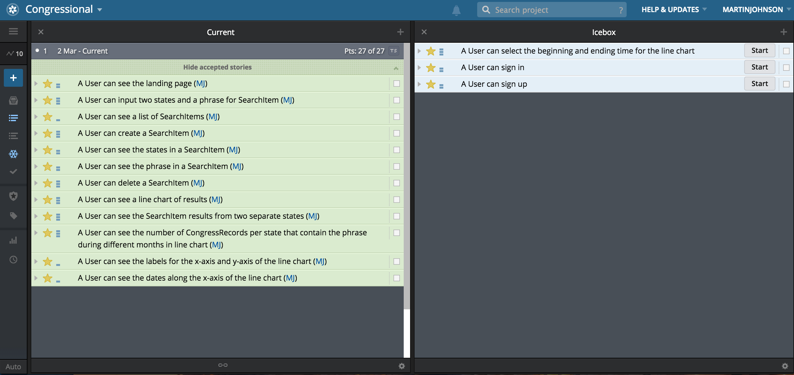
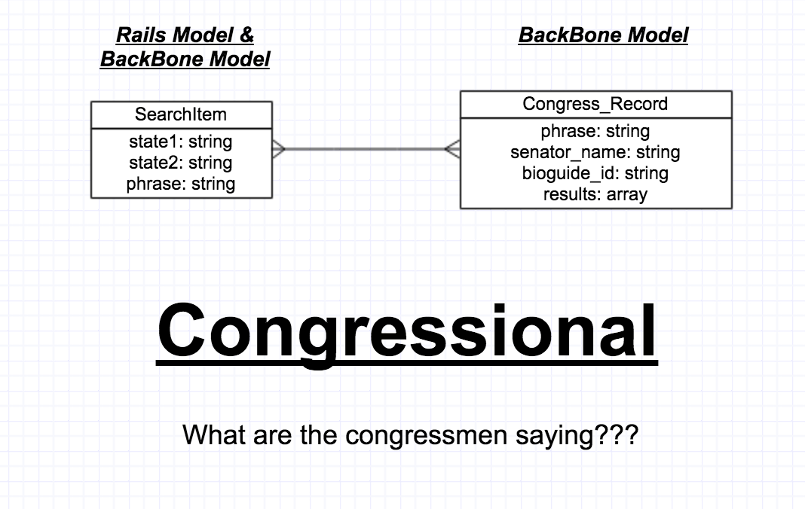

#Congressional

###Overview

**Senatorial** tells you what senators and conressmen are talking about on the floor of the House or Senate.  

The User puts in a couple of states, like CA and NV and a phrase like health. Then it uses the Capital Words API to return the number of Congressional Records over the last few years that contain that phrase. All displayed in a line chart using D3 and C3!

This is a single page app that has a Rails backend on the first model and is using Backbone with two Models.

[Visit Congressional] (https://secure-plains-1434.herokuapp.com/)

Senatorial uses one external API:
Capitol Words: http://tryit.sunlightfoundation.com/capitolwords

Based on two states and phrase query selections by the user, data is passed to the Capital Words API.

###Backlog: 

###Technology used:
- Ruby on Rails
- JavaScript/JQuery
- Backbone.js
- D3.js
- C3.js

###ERD:

### Local Setup

    rake db:create
    bundle install
    rake db:migrate
    rake db:seed
    rails s

    Open the page locally on http://localhost:3000.
    Note that you will need to request access token for the Capital Words API and replace it as appropriate within the code. 
    
=
######Written by Martin Johnson
